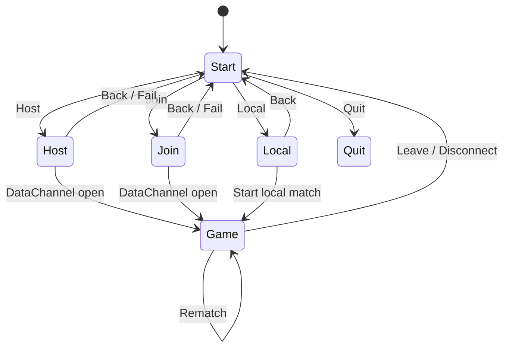

# Deterministic P2P Pong — Design Specification

A concise, comprehensive, and implementable spec for a cross‑platform Pong with a shared Rust core, terminal (TUI) client, and web (WASM) client. Direct P2P via WebRTC DataChannel and manual SDP exchange.

---

## 1) Overview

- Shared Rust core `pong_core`: deterministic game state, per‑tick simulation, compact serialization. Compiles to native and WASM.
- Lockstep netcode: each peer sends inputs per tick; both step the same simulation. Optional snapshots for resync.
- Transport: WebRTC DataChannel with manual Offer/Answer (copy/paste). No STUN/TURN or signaling; LAN only.
- Clients:
  - Terminal: `ratatui` + `crossterm`, enhanced keyboard detection with momentum fallback.
  - Web: DOM/JS UI with mobile‑friendly controls; core in WASM.

Per‑tick loop:
1) Read local input → `axis_y:i8` and `buttons:u8`.
2) Send local input for tick T; buffer locally.
3) When both inputs for T exist, call `Game::step`.
4) Render `Game::view`; handle events.
5) Increment T and repeat.

---

## 2) Architecture

```
+-------------------------+        WebRTC DataChannel       +-------------------------+
| Terminal Client (Rust)  | <-----------------------------> | Web Client (JS + WASM)  |
|                         |         (Input, Snapshot)       |                         |
|  Input Mapper (keys)    |                                 |  Input Mapper (touch)   |
|  Lockstep (tick/queue)  |                                 |  Lockstep (tick/queue)  |
|  Transport (RTC)        |                                 |  Transport (RTC)        |
|  pong_core (native)     |                                 |  pong_core (WASM)       |
|  TUI Renderer           |                                 |  DOM Renderer           |
+-------------------------+                                 +-------------------------+
```

Directory layout:
```
/pong_core/            # Rust lib (native + WASM)
/clients/terminal/     # Rust app (ratatui + crossterm)
/clients/web/          # HTML/JS/TS + wasm-bindgen
```

---

## 3) Screens and Navigation

Screens (both clients):
- Start: Host, Join, Local, Quit
- Host: show Offer, paste Answer, connect
- Join: paste Offer, show Answer, connect
- Local: start offline vs AI, vs Wall, or vs Local Player 2
- Game: shared playfield; Rematch or Leave

State diagram:


---

## 4) Core Module (`pong_core`)

Determinism:
- Fixed‑point 16.16 integers for all gameplay math.
- Normalized field: width = 1.0, height = 1.0 (UI maps to pixels/rows).
- One tick = one deterministic step. No wall‑clock in simulation.

Key types:
- `type Tick = u32; type Fx = i32; const FX_ONE: Fx = 1 << 16;`
- `struct Config { paddle_half_h: Fx, paddle_speed: Fx, ball_speed: Fx, ball_speed_up: Fx, wall_thickness: Fx, paddle_x: Fx, max_score: u8, seed: u64, tick_hz: u16 }`
- `enum Side { Left, Right }`
- `enum Status { Lobby, Countdown(u16), Playing, Scored(Side, u16), GameOver(Side) }`
- `struct Paddle { y: Fx, vy: Fx }`
- `struct Vec2 { x: Fx, y: Fx }`
- `struct Ball { pos: Vec2, vel: Vec2 }`
- `struct Game { cfg, tick, status, paddles:[Paddle;2], ball:Ball, score:[u8;2], rng:u64 }`
- `struct Input { axis_y: i8, buttons: u8 }`  // `axis_y` in [-127,127]
- `struct InputPair { tick: Tick, a: Input, b: Input }`
- `struct Snapshot { tick, status, paddles, ball, score, rng }`
- `struct View { tick, status, left_y, right_y, paddle_half_h, ball_pos, score }`
- `enum Event { Scored { scorer: Side, score: [u8;2] } }`

Public API:
- `Game::new(cfg: Config) -> Game`
- `Game::step(&mut self, inputs: &InputPair) -> Option<Event>`
- `Game::view(&self) -> View`
- `Game::snapshot(&self) -> Snapshot`
- `Game::restore(&mut self, s: &Snapshot)`

Serialization:
- `Input::encode/decode`, `InputPair::encode/decode`, `Snapshot::encode/decode` using small, fixed little‑endian formats. No external dependencies.

WASM bridge (`pong_core/src/wasm.rs`):
- `struct WasmGame { inner: Game }`
- `WasmGame::new(cfg_json: String) -> Result<WasmGame, JsValue>`
- `WasmGame::step(tick: u32, a_axis: i8, a_btn: u8, b_axis: i8, b_btn: u8) -> Option<String>` // JSON event or null
- `WasmGame::view_json() -> String`
- `WasmGame::snapshot_bytes() -> Vec<u8>`
- `WasmGame::restore_bytes(bytes: &[u8])`

---

## 5) Lockstep Netcode

Responsibilities:
- Maintain tick T, side assignment, input buffers.
- Each tick: push local input, send to peer, step when both inputs for T available.
- Decode incoming bytes, insert into buffers.
- Optional: snapshots for resync.

Rust interface (terminal):
- `trait CoreAdapter { fn step(&mut self, pair:&InputPair)->Option<Event>; fn view(&self)->View; fn snapshot(&self)->Snapshot; fn restore(&mut self, s:&Snapshot); }`
- `trait Transport { fn send(&self, bytes:&[u8]) -> Result<(), TransportError>; fn set_on_message(&mut self, f: Box<dyn Fn(Vec<u8>) + Send>); fn is_open(&self)->bool; }`
- `enum WireMsg { InputPair(InputPair), Snapshot(Vec<u8>), Ping(u32) }`
- `struct Lockstep<C:CoreAdapter, T:Transport> { ... }`
  - `new(core, tx, tick_hz, local_side, is_timekeeper) -> Self`
  - `on_local_input(axis_y:i8, buttons:u8)`
  - `tick() -> (View, Vec<Event>)`
  - `on_net_bytes(bytes:&[u8])`
  - `request_snapshot()`
  - `apply_snapshot(data:&[u8])`

JS interface (web):
- `interface Transport { send(bytes:Uint8Array):void; onMessage(cb:(bytes:Uint8Array)=>void):void; isOpen():boolean }`
- `interface Core { step(...): any|null; view_json():string; snapshot_bytes():Uint8Array; restore_bytes(bytes:Uint8Array):void }`
- `class Lockstep { constructor(core, tx, tickHz, localSide, isTimekeeper); onLocalInput(axisY:number, buttons:number):void; tick(): { view:any, events:any[] }; onNetBytes(bytes:Uint8Array):void; requestSnapshot():void; applySnapshot(bytes:Uint8Array):void; }`

Late/_missing packets:
- Do not advance T until both inputs for T present.
- Keep rendering last confirmed `View`.
- Keep sending local inputs for successive ticks (buffers allow catching up).

---

## 6) Transport (WebRTC DataChannel)

Manual pairing (no signaling):
- Host creates Offer, shows SDP.
- Join pastes Offer, creates Answer, shows SDP.
- Host pastes Answer.
- On `datachannel.onopen`, transition to `Game`.

Rust (terminal):
- `struct RtcTransport { ... }`
  - `new_manual_sdp(mode: Mode) -> Result<(Self, String), TransportError>` // returns local SDP (Offer or Answer)
  - `set_remote_sdp(sdp: String) -> Result<(), TransportError>`
  - Implements `Transport`.

Web (JS):
- `class RtcTransport implements Transport { constructor(mode:"offer"|"answer"); localSdp():Promise<string>; setRemoteSdp(sdp:string):Promise<void>; send(bytes:Uint8Array):void; onMessage(cb:(bytes:Uint8Array)=>void):void; isOpen():boolean }`

Channel settings:
- Start with ordered + reliable (simplest).
- Optional: unordered + maxRetransmits: 0 for lower latency; if used, consider occasional snapshots to recover.

---

## 7) Wire Protocol

Single‑byte type header:
- `0x01` InputPair: `[0x01][tick:u32][a_axis:i8][a_btn:u8][b_axis:i8][b_btn:u8]` // 9 bytes
- `0x02` Snapshot: `[0x02][snapshot_bytes...]`  // encoded by `Snapshot::encode`
- `0x03` Ping (optional): `[0x03][client_time_ms:u32]`

Parsing:
- `on_net_bytes`: switch on type; decode to `WireMsg`; update buffers or apply snapshot.

---

## 8) Client Implementations

### Terminal (Rust, `ratatui` + `crossterm`)
State:
- `struct TerminalApp { screen: AppScreen, lockstep, rtc: Option<RtcTransport>, key_mode: KeyMode, sdp: { offer:String, answer:String }, local_mode: LocalMode }`
- `enum AppScreen { Start, Host, Join, Local, Game }`
- `enum LocalMode { VsAI, VsWall, VsLocal2 }`
- `enum KeyMode { Enhanced, BasicMomentum }`

Input mapping:
- Enhanced: Up/Down → `axis_y = ±127`; none → `0`. Space for Ready (button bit 0).
- BasicMomentum: local easing `[-1,1]` mapped to `i8`; smoother on limited terminals.

Rendering:
- Start/Host/Join/Local: centered panels, text inputs for SDP, buttons (hotkeys).
- Game: borders, paddles as vertical bars, ball as dot, score at top.

Game wiring:
- Networked: `Lockstep<RustCoreAdapter, RtcTransport>`.
- Local:
  - VsAI: AI controls remote `axis_y`.
  - VsWall: reflect ball at wall side (fake paddle collision).
  - VsLocal2: second player keys (e.g., W/S) → remote `axis_y`.

### Web (JS + DOM + WASM)
State:
- `class WebApp { state, lockstep, rtc, localMode, controls }`

Controls:
- Touch drag region maps vertical movement to `axis_y` in [-127,127].
- On‑screen Up/Down buttons for accessibility.
- Ready/Rematch/Leave buttons mapped to button bits and navigation.

Rendering:
- Monospace “terminal look” via CSS.
- Simulation ticks via `setInterval(1000 / tickHz)`.
- Rendering via `requestAnimationFrame` using `view_json()`.

---

## 9) Local Modes

- Vs AI: remote input generated each tick:
  - `axis_y ≈ clamp((ball_y - paddle_y) * K)`, with small `K`, plus dead zone.
- Vs Wall: when ball reaches wall side, reflect X as if paddle centered; ignore remote input.
- Vs Local 2: second keyboard/touch input feeds remote `axis_y`.

---

## 10) Defaults

`Config` recommended defaults:
- `paddle_half_h = FX_ONE / 8`
- `paddle_speed = (FX_ONE * 3) / 2`  // 1.5 units/s
- `ball_speed   = FX_ONE / 2`        // 0.5 units/s
- `ball_speed_up= FX_ONE + (FX_ONE / 20)`  // +5% per paddle hit
- `wall_thickness = 0`
- `paddle_x = FX_ONE / 20`  // 5% from edge
- `max_score = 11`
- `seed = 0xC0FFEE`
- `tick_hz = 60`

Buttons:
- Bit 0 = Ready/Start toggle (optional Lobby→Countdown).
- Bit 1 = Pause (optional; can be ignored initially).

Rematch:
- Reset scores, reseed or reuse seed, `reset_for_serve()`.

---

## 11) Flows

Pairing (Host/Join):
- Host: Create Offer → show SDP → paste Answer → on open → `Game`.
- Join: Paste Offer → Create Answer → show SDP → wait for open → `Game`.
- Fail or Back returns to `Start`.

Game tick:
- Read controls → `on_local_input(axis, buttons)`.
- `tick()` → may step or wait (if remote missing).
- Render `view`; handle `Event`s (e.g., scored).

Disconnect:
- If channel closes or times out → return to `Start`.

---

## 12) Testing

Core (`pong_core`):
- Unit tests: paddle/ball collisions, scoring, deterministic serve from seed.
- Serialization roundtrips: `Input`, `InputPair`, `Snapshot`.

Lockstep:
- Simulated latency/loss: ensure step only when both inputs exist.
- Snapshot request/apply restores sync.

Transport:
- Loopback transport for protocol tests.
- RTC smoke tests for open/send/receive/close.

Cross‑platform determinism:
- Scripted inputs produce identical scores/snapshots on native and WASM.

---

## 13) Milestones

- M1: `pong_core` with tests; CLI harness (two local inputs).
- M2: Terminal renderer + input; Local Vs Local2.
- M3: Web WASM + DOM UI; local modes.
- M4: WebRTC transports + Host/Join screens; cross‑play.
- M5: QoL: Rematch, Ready/Countdown, snapshots for resync; mobile controls polish.

---

## 14) File Map (minimum)

- `pong_core/src/lib.rs`: `Game`, `Config`, `Input`, `InputPair`, `Snapshot`, `View`, `Event`.
- `pong_core/src/wasm.rs`: `WasmGame` bridge.
- `clients/terminal/src/main.rs`: `TerminalApp`, screens, key mapping, render loop.
- `clients/terminal/src/lockstep.rs`: `Lockstep`, `Transport` trait.
- `clients/terminal/src/rtc_transport.rs`: `RtcTransport`.
- `clients/web/index.html`, `clients/web/app.ts`, `clients/web/lockstep.ts`, `clients/web/rtc_transport.ts`.

---

## 15) Notes

- Keep all simulation time‑based logic inside `pong_core::step` driven by ticks only.
- UI layers are free to interpolate for visuals, but must not alter inputs after submission for a tick.
- Start with reliable/ordered channels; optimize later if needed.
- Manual SDP exchange is presented as two textareas (Offer/Answer) in both clients.